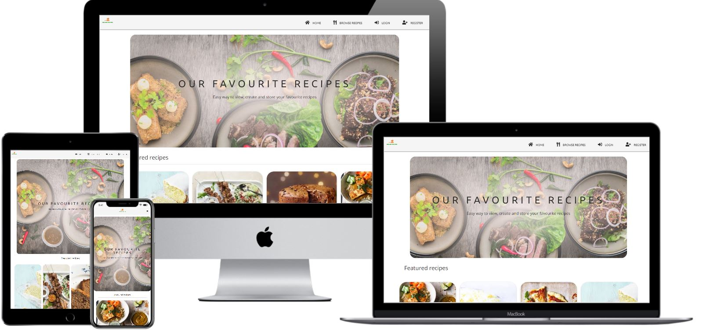

# Online Recipes

## "Online Recipes" - Practical Python and Data-Centric Development Milestone Project.

The main purpose of this full-stack MongoDB-based Flask project is to create a database of recipes that allows users to create, read, update and delete (CRUD) recipes.
"Online Recipes" gives an access to all the recipes in the database for non-registered users.
At the same time, it gives the opportunity to create an account and benifit from having convenient access to all features of the website.
Registered users can add new recipes, edit and delete their own ones,as well delete account.
Online Recipes is a simple way to view, create and store your recipes!

# User Stories
## As a user, I want/expect:

1. to view all the recipes without having to register.
2. to view all recipe details (including cuisine, meal and diet types, cooking time, servings, list of ingredients and directions).
3. to see how many recipes are on the website.
4. to create my own account.
5. to add new recipes.
6. to edit my recipes.
7. to view a list of my recipes on a separate page and see how many recipes I've created.
8. to delete my recipes.
9. to log out any time and have the session terminated.
10. to delete my account and all recipes I've created.
11. to use the website from any device (laptop, tablet, mobile).

# Features
## Features Left to Implement:
1. My favourites
User would have an opportunity to "like" other recipes, saving them in "my favourites" collection, which would be displayed on a separate page. Each recipe card will include a small "heart" icon, clicking which will enable user to add the selected recipe to "my favourits".

# Technologies Used
- GitPod - an online IDE for developing this project.
- GitHub - for remotely storing project's code.
- PIP - for installation of necessary tools.
## Front-End
- HTML - to build the foundation of the project.
- CSS - to create custom styles.
## Back-End
- Python - back-end programming language used in this project.
- Flask  - microframework for building and rendering pages.
- MongoDB Atlas - NoSQL database for storing back-end data.
- PyMongo - for Python to get access the MongoDB database.
- WTForms  - for creating forms with validation.
- Werkzeug  - to generate and verify password hashing.
- Jinja  - templating language for Python, to display back-end data in HTML.
- Heroku - to host the project.
## Libraries
- Materialize  - main responsive modern front-end framework used for grid and responsivesness.
- FontAwesome - to provide icons used across the project.
- JQuery - to simplify DOM manipulation and to initialize Materialize functions.
# Testing
## Manual Testing

### All recipes and single recipe display
When I click on "All Recipe page", I can see recipe cards displayed in rows, 8 recipes per page. In that view, I can see image, recipe name and short information about the recipe. Clicking on the recipe card redirects me to the single recipe page, where I can see all the detailed information about the recipe. I tested this functionality as a non-logged in (guest) user and a logged in user and it perfectly worked in both cases. I also can see the total number of the recipes in parentheses. I tried to add and delete some recipes, and this number changed accordingly.

### Create a new user account
I created my main account, as well as a few test accounts to test this functionality. Clicking on the "Register" button in the navbar opens the form, where I can put username and password to create a new account. I tried to input an existing username, not matching passwords in "password" and "confirm password" fields, and input less then 3 or more then 15 charachters. In all cases I got a corresponding flash error message. As well as that, I tried to leave an empty field and submit the form, but got an error message again asking to fill the field. When the form was successfully submitted, I was redirected to the home page, seeing a message that my new account was created. I also checked the link to the Login page at the bottom of the form, which worked well.

### Login
Clicking on the "Login" button in the navbar opens the form, allowing me to login to my account. I tried to leave empty fields or input incorrect details, but I was not able to submit the form if something was entered incorrectly. After a successful login I was redirected to the home page, seeing the message that I was logged in. I also checked the link to the Register page at the bottom of the form, which worked well.

### Delete Account
I deleted some testing accounts to test the functionality. Followed by clicking the "Delete account" button on the Account Settings page, the modal opens and I am asked to confirm the deletion by entering my password. I tried to put the wrong password, but got an error flash message. When I input the correct password, I am redirected to the home page and see the message that my account was deleted. Then, I checked the database to make sure that the account as well as all the recipes created by this user were removed.

### Add New Recipe
I added plenty of test recipes to check the functionality throughout the development. If I leave some of the required fields empty, I will not be able to submit the form. I can see the flash messages displayed if my input does not meet length requirement. I also tried to create recipe without the URL image provided, to check if the placeholder is in place and it works well.

### Edit Recipe
If I am the author of selected recipe, I can see the buttons "Edit" and "Delete" in the single_recipe page. I tried to view someone else's recipes and the buttons were not displayed. I also tried to change the link manually in the browser to edit other's recipe. However, I was not able to open the form and got the message, that I can only edit my own recipes, which means defensive design works well against brute forcing. Being the author of the recipe, I can view the form with pre-populated fields and can change anything that I want. If all fields are valid, I can see the changes I made in a Single Recipe Details Page after the submission. I tried to edit a number of recipes and edit different fields, everything worked correctly.

### Delete Recipe
I deleted some dummy testing recipes to test the functionality. After clicking the "delete" button, I saw the modal showing up asking me to confirm the deletion. After clicking "Cancel" I was redirected back and modal closeed. After clicking "Delete" button in the modal, I was redirected to the home page and saw the message about the succsessful deletion.
Then I checked the database to make sure, that the recipe was removed. As well as that, I tested against brute-forcing, trying to delete another user's recipe(by changing the link manually in the browser), but wasn't able to do that.

## Validators 
### Html
All the HTML files were tested through W3C Markup Validation Service. Since it does not recognize Jinja2 templating language, it showed a number of errors. Apart from that, no other errors were found across the html pages.
### CSS
CSS files were tested through W3C CSS Validation Service and No Error Found.
### Python
All python files were tested through PEP8 Online validator and were completely PEP8 compliant
### JavaScript
JS file was tested through Esprima validator, code was syntactically valid.

# Deployment
## Local Deployment
To be able to run this project, the following tools have to be installed:

- GitPod
- MongoDB Atlas (for creation your database)
- GitHub
- Python
- Heroku 

## Directions

1. You can clone this repository directly into the editor of your choice by pasting the following command into the terminal:
      git clone https://github.com/rawanebeidat/Cook-Book-MS3.
2. In the terminal window change directory (CD) to the correct file location.
3. Set up environment variables:
     - Create .env file in the root directory.
     - on the top of the file add import os to set the environment variables in the operating system.
     - Set the connection to your MongoDB database(MONGO_URI) and a SECRET_KEY with the following syntax:
       -  os.environ["SECRET_KEY"] = "YourSecretKey"
       -  os.environ["MONGO_URI"] = "YourMongoURI".
4. Install all requirements from the requirements.txt file putting this command into your terminal:
     pip3 install -r requirements.txt.
5. Create a new Database called "cook-book" in MongoDB Atlas.
   You can sign up for free account, if you do not have one.
6. In "cook-book" database create five following collections:
   1. Cuisines.
   2. Meals.
   3. Diets.
   4. Users.
   5. Recipes.

7. You will now be able to run the application using the following command:
 python3 app.py.

## Heroku Deployment
To deploy the project to Heroku the following steps need to be completed:

1.  Create a requirement.txt file, which contains a list of the dependencies, using the following command in the terminal:
      pip3 freeze > requirements.txt

2.  Create a Procfile, in order to tell Heroku how to run the project, using the following command in the terminal:
       echo web: python app.py > Procfile

3.  git add, git commit and git push these files to GitHub repository

4.  Create a new app in Heroku, assigning a name (must be unique) and set a region (for my project I set USA)

5.  From the Heroku dashboard link the new Heroku app to your GitHub repository:

   - "Deploy" -> "Deployment method" -> "GitHub"
   - then "Enable automatic deployment"

6.  In the Settings tab of the new Heroku app, click on "Reveal Config Vars" and set the following config vars:

     - IP : 0.0.0.0
     - PORT : 5000
     - MONGO_URI : link to your MongoDB database.
     - SECRET_KEY : your secret key.
     - DEBUG: FALSE
 
       Note: your MONGO_URI and SECRET_KEY must match the ones you entered in .env.py file
7. The app will be deployed and ready to run. Click "Open App" to view the app.

# Credits
## Content
Recipes and recipes' images:
-  https://www.bbcgoodfood.com/ 
-  https://www.delicious.com.au/.

## Media
The project images are taken from the following sources:

- Homepage background  : Unsplash.
- Forms and search background image : Pixels.
- Favicon : Clipart-Library.
- Logo : designevo.
- Recipe placeholder is taken from free available Google images.

## Code
- Stackoverflow: how-to-validate-select-option-for-a-materialize-dropdown:
     https://stackoverflow.com/questions/34248898/how-to-validate-select-option-for-a-materialize-dropdown.
- For building the Register, Login, as well as for better understanding session , I used the following tutorials:
     https://www.youtube.com/watch?v=eu0tg4vgFr4&list=PLXmMXHVSvS-C_T5JWEDWIc9yEM3Hj52-1.
- For UI & UX design concept I took inspiration from different projects found GitHub submission.

## Acknowledgements:

This project is for educational use only.
